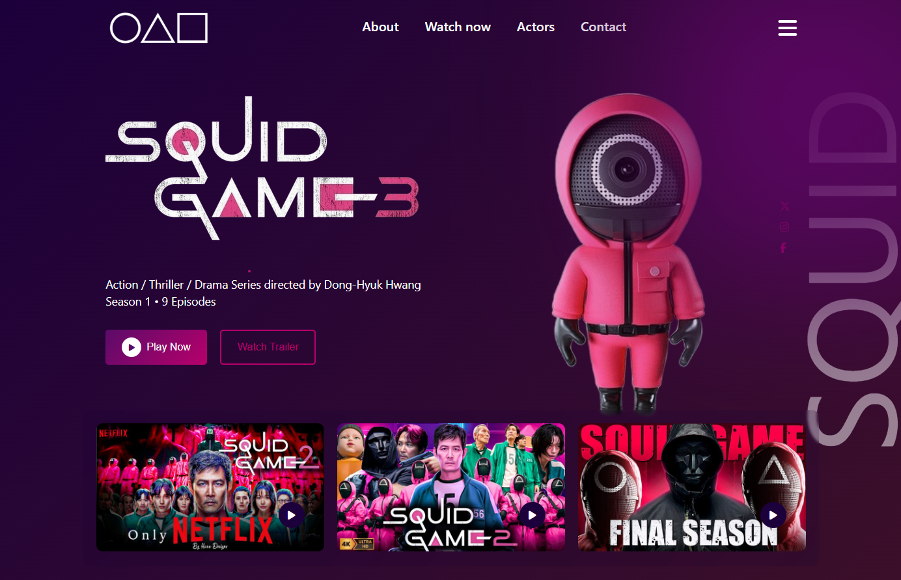

# Squid Game

A responsive web design rendition inspired by *Squid Game*. Dive into the visuals and engage with an interactive experience.

---

##  Demo



You can watch the project’s trailer directly here:

[Watch the Tutorial:]()

---

##  Getting Started

### Clone the repository:
```bash
git clone https://github.com/aziz-chniti/squid-game.git
cd squid-game
```

### Launch the Project:
- Open `index.html` in your browser to explore the experience.

---

##  Project Structure

```
squid-game/
├── img/
├── index.html
├── style.css
└── script.js
```

---

##  Technologies Used

- **HTML5** – Core structure and layout  
- **CSS3** – Styling and responsive adaptation  
- **JavaScript** – Dynamic interactions and UI logic

---

## Resources

📘 **Get my Frontend Development eBook:**  
- [https://barmajli.gumroad.com/l/iiflx](https://barmajli.gumroad.com/l/iiflx)

🎬 **Follow my YouTube channel:**  
- [https://www.youtube.com/@Barmajli](https://www.youtube.com/@Barmajli)

---

##  Credits

Developed by **aziz-chniti** a web dev.

---